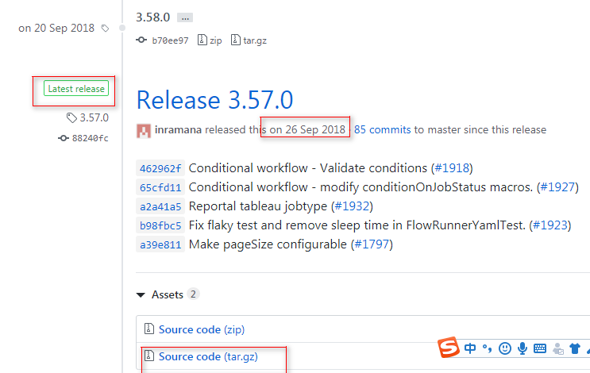
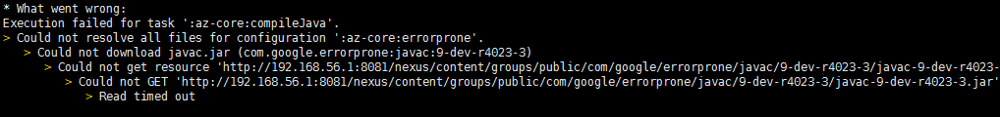
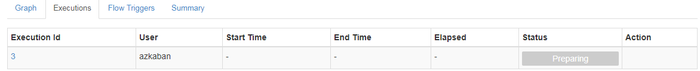
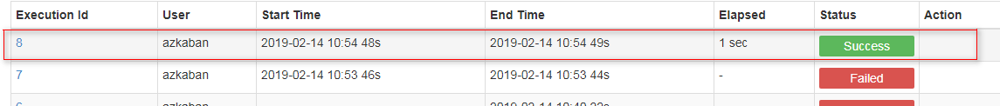

# azkaban安装测试

## 从源码编译

https://azkaban.readthedocs.io/en/latest/getStarted.html#building-from-source

```
Azkaban builds use Gradle (downloads automatically when run using gradlew which is the Gradle wrapper) and requires Java 8 or higher.

The following commands run on *nix platforms like Linux, OS X.

# Build Azkaban
./gradlew build

# Clean the build
./gradlew clean

# Build and install distributions
./gradlew installDist

# Run tests
./gradlew test

# Build without running tests
./gradlew build -x test
These are all standard Gradle commands. Please look at Gradle documentation for more info.
```

1. 需要java8以上的环境，这里就用java8
2. 安装gradle


### 下载源码

github找到最新的发布版本（2018.9.26）



h101新建编译的用户，编译的工作运行在这个用户上

```
[root@h101 ~]# useradd compile

```

设置密码，用compile用户登录h101

上传: azkaban-3.57.0.tar.gz

### 准备环境

设置java8环境

```
[compile@h101 ~]$ vi .bash_profile
export JAVA_HOME=/usr/local/java8
export PATH=$JAVA_HOME/bin:$PATH

[compile@h101 ~]$ source .bash_profile
[compile@h101 ~]$ which java
/usr/local/java8/bin/java

[compile@h101 ~]$ java -version
java version "1.8.0_171"
Java(TM) SE Runtime Environment (build 1.8.0_171-b11)
Java HotSpot(TM) 64-Bit Server VM (build 25.171-b11, mixed mode)

```

验证私服环境访问正常：

```
[compile@h101 azkaban-3.57.0]$ curl http://192.168.56.1:8081/nexus/content/groups/public/
```

### 编译

解压

进入目录, 修改build.gradle文件，修改maven配置为私服

```
     17 buildscript {
     18     repositories {
     19         maven {
     20             url 'http://192.168.56.1:8081/nexus/content/groups/public/'
     21         }
     22     }

```


```
     48 allprojects {
     49     apply plugin: 'jacoco'
     50 
     51     repositories {
     52         maven {
     53             url 'http://192.168.56.1:8081/nexus/content/groups/public/'
     54         }
     55         mavenLocal()
     56     }
     57 }

```


```
Build Azkaban and create an installation package:

cd azkaban; ./gradlew build installDist
```

进入解压开的目录，执行

```
 ./gradlew build installDist -x test
```


报错，显示没安装git命令

```
Download https://plugins.gradle.org/m2/commons-codec/commons-codec/1.6/commons-codec-1.6.jar
Download https://plugins.gradle.org/m2/net/ltgt/gradle/gradle-errorprone-plugin/0.0.14/gradle-errorprone-plugin-0.0.14.jar

FAILURE: Build failed with an exception.

* Where:
Build file '/home/compile/azkaban-3.57.0/build.gradle' line: 40

* What went wrong:
A problem occurred evaluating root project 'azkaban'.
> Failed to apply plugin [id 'com.cinnober.gradle.semver-git']
   > Cannot run program "git" (in directory "/home/compile/azkaban-3.57.0"): error=2, 没有那个文件或目录

* Try:
Run with --stacktrace option to get the stack trace. Run with --info or --debug option to get more log output. Run with --scan to get full insights.

* Get more help at https://help.gradle.org

BUILD FAILED in 5m 20s

```


安装git

```
[root@h101 ~]# yum install git
......
[root@h101 ~]# git --version
git version 1.8.3.1

```




碰到这类错误，直接重新运行

```
 ./gradlew build installDist -x test
```


```
> Task :azkaban-common:compileJava 
错误: 读取/home/compile/.gradle/caches/modules-2/files-2.1/mysql/mysql-connector-java/5.1.28/63638386ed42c57e52a57cd488b998ff1b9726e9/mysql-connector-java-5.1.28.jar时出错; invalid LOC header (bad signature)
注: 某些输入文件使用或覆盖了已过时的 API。

```

maven私服上的该文件有问题，删除maven私服上的这个版本的mysql central（仓库），再删除

```
rm -rf /home/compile/.gradle/caches/modules-2/files-2.1/mysql/mysql-connector-java/5.1.28/
```

再重跑，直到没有报错最后提示成功

```
[compile@h101 distributions]$ pwd
/home/compile/azkaban-3.57.0/azkaban-solo-server/build/distributions
[compile@h101 distributions]$ ll
总用量 46752
-rw-rw-r--. 1 compile compile 23868898 2月  13 10:51 azkaban-solo-server-0.1.0-SNAPSHOT.tar.gz
-rw-rw-r--. 1 compile compile 24001205 2月  13 10:51 azkaban-solo-server-0.1.0-SNAPSHOT.zip

```

编译完成后，生成以下文件

```
[compile@h101 azkaban-3.57.0]$ find .|grep distributions|grep zip
./az-crypto/build/distributions/az-crypto-0.1.0-SNAPSHOT.zip
./az-hadoop-jobtype-plugin/build/distributions/az-hadoop-jobtype-plugin-0.1.0-SNAPSHOT.zip
./az-hdfs-viewer/build/distributions/az-hdfs-viewer-0.1.0-SNAPSHOT.zip
./az-jobsummary/build/distributions/az-jobsummary-0.1.0-SNAPSHOT.zip
./az-reportal/build/distributions/az-reportal-0.1.0-SNAPSHOT.zip
./azkaban-db/build/distributions/azkaban-db-0.1.0-SNAPSHOT.zip
./azkaban-exec-server/build/distributions/azkaban-exec-server-0.1.0-SNAPSHOT.zip
./azkaban-hadoop-security-plugin/build/distributions/azkaban-hadoop-security-plugin-0.1.0-SNAPSHOT.zip
./azkaban-solo-server/build/distributions/azkaban-solo-server-0.1.0-SNAPSHOT.zip
./azkaban-web-server/build/distributions/azkaban-web-server-0.1.0-SNAPSHOT.zip

```

```
[compile@h101 azkaban-3.57.0]$ find .|grep distributions|grep tar.gz
./az-crypto/build/distributions/az-crypto-0.1.0-SNAPSHOT.tar.gz
./az-hadoop-jobtype-plugin/build/distributions/az-hadoop-jobtype-plugin-0.1.0-SNAPSHOT.tar.gz
./az-hdfs-viewer/build/distributions/az-hdfs-viewer-0.1.0-SNAPSHOT.tar.gz
./az-jobsummary/build/distributions/az-jobsummary-0.1.0-SNAPSHOT.tar.gz
./az-reportal/build/distributions/az-reportal-0.1.0-SNAPSHOT.tar.gz
./azkaban-db/build/distributions/azkaban-db-0.1.0-SNAPSHOT.tar.gz
./azkaban-exec-server/build/distributions/azkaban-exec-server-0.1.0-SNAPSHOT.tar.gz
./azkaban-hadoop-security-plugin/build/distributions/azkaban-hadoop-security-plugin-0.1.0-SNAPSHOT.tar.gz
./azkaban-solo-server/build/distributions/azkaban-solo-server-0.1.0-SNAPSHOT.tar.gz
./azkaban-web-server/build/distributions/azkaban-web-server-0.1.0-SNAPSHOT.tar.gz

```

这里下载所有的tar.gz吧。

```
[compile@h101 azkaban-3.57.0]$ sz ./az-hadoop-jobtype-plugin/build/distributions/az-hadoop-jobtype-plugin-0.1.0-SNAPSHOT.tar.gz
[compile@h101 azkaban-3.57.0]$ sz ./az-hdfs-viewer/build/distributions/az-hdfs-viewer-0.1.0-SNAPSHOT.tar.gz
[compile@h101 azkaban-3.57.0]$ sz ./az-jobsummary/build/distributions/az-jobsummary-0.1.0-SNAPSHOT.tar.gz
[compile@h101 azkaban-3.57.0]$ sz ./az-reportal/build/distributions/az-reportal-0.1.0-SNAPSHOT.tar.gz
[compile@h101 azkaban-3.57.0]$ sz ./azkaban-db/build/distributions/azkaban-db-0.1.0-SNAPSHOT.tar.gz
[compile@h101 azkaban-3.57.0]$ sz ./azkaban-exec-server/build/distributions/azkaban-exec-server-0.1.0-SNAPSHOT.tar.gz
[compile@h101 azkaban-3.57.0]$ sz ./azkaban-hadoop-security-plugin/build/distributions/azkaban-hadoop-security-plugin-0.1.0-SNAPSHOT.tar.gz
[compile@h101 azkaban-3.57.0]$ sz ./azkaban-solo-server/build/distributions/azkaban-solo-server-0.1.0-SNAPSHOT.tar.gz
[compile@h101 azkaban-3.57.0]$ sz ./azkaban-web-server/build/distributions/azkaban-web-server-0.1.0-SNAPSHOT.tar.gz

```

修改0.1.0-SNAPSHOT 为 3.57.0

将gradle的依赖也打包

```
[compile@h101 ~]$ tar -cvf gradle.azkaban-3.57.0.tar .gradle
```


## 安装

### Solo Server

上传文件

```
[app@h101 ~]$ mkdir az
[app@h101 ~]$ cd az
[app@h101 az]$ ls
azkaban-solo-server-3.57.0.tar.gz
[app@h101 az]$tar -zxvf azkaban-solo-server-3.57.0.tar.gz

[app@h101 az]$ mv azkaban-solo-server-0.1.0-SNAPSHOT azkaban-solo-server-3.57.0
[app@h101 az]$ 

启动
[app@h101 az]$ cd azkaban-solo-server-3.57.0
[app@h101 azkaban-solo-server-3.57.0]$ bin/start-solo.sh 
[app@h101 azkaban-solo-server-3.57.0]$ jps
4251 AzkabanSingleServer

```

访问： http://h101:8081/


```
[app@h101 conf]$ pwd
/home/app/az/azkaban-solo-server-3.57.0/conf
[app@h101 conf]$ more azkaban-users.xml 
<azkaban-users>
  <user groups="azkaban" password="azkaban" roles="admin" username="azkaban"/>
  <user password="metrics" roles="metrics" username="metrics"/>

  <role name="admin" permissions="ADMIN"/>
  <role name="metrics" permissions="METRICS"/>
</azkaban-users>

```

用azkaban/azkaban登录成功

测试：

https://azkaban.readthedocs.io/en/latest/createFlows.html

- [basicFlow20Project.zip](https://github.com/azkaban/azkaban/blob/master/az-examples/flow20-projects/basicFlow20Project.zip)
- [embeddedFlow20Project.zip](https://raw.githubusercontent.com/azkaban/azkaban/master/az-examples/flow20-projects/embeddedFlow20Project.zip)

这里直接下载以上的zip包，上传到azkaban的一个项目运行成功


### Multi Executor Server

https://azkaban.readthedocs.io/en/latest/getStarted.html#getting-started-with-the-multi-executor-server

#### 配置mysql

```
[root@h104 ~]# service mysqld start
Redirecting to /bin/systemctl start mysqld.service

```


```
CREATE DATABASE azkaban;

CREATE USER 'azkaban'@'%' IDENTIFIED BY 'azkaban';

GRANT SELECT,INSERT,UPDATE,DELETE ON azkaban.* to 'azkaban'@'%' WITH GRANT OPTION;
```


Mysql Packet Size may need to be re-configured. MySQL may have, by default, a ridiculously low allowable packet size. To increase it, you’ll need to have the property max_allowed_packet set to a higher number, say 1024M. To configure this in linux, open /etc/my.cnf. Somewhere after mysqld, add the following:

```
[mysqld]
...
max_allowed_packet=1024M
```

To restart MySQL, you can run:

```
$ sudo /sbin/service mysqld restart
```


```
[root@h104 etc]# vi my.cnf
...
max_allowed_packet=1024M
[root@h104 etc]# service mysqld restart
Redirecting to /bin/systemctl restart mysqld.service

```


执行以下sql文件

```
azkaban-db-3.57.0.tar.gz\azkaban-db-0.1.0-SNAPSHOT\create-all-sql-0.1.0-SNAPSHOT.sql
```

报错：

```
[SQL]CREATE TABLE active_executing_flows (
  exec_id     INT,
  update_time BIGINT,
  PRIMARY KEY (exec_id)
);
[Err] 1142 - CREATE command denied to user 'azkaban'@'h1' for table 'active_executing_flows'


```

授权所有权限

```
GRANT ALL ON azkaban.* to 'azkaban'@'%' WITH GRANT OPTION;
FLUSH PRIVILEGES
```

再执行sql文件就成功了。

#### 安装Azkaban Executor Server

```
[app@h101 ~]$ mkdir az
[app@h101 ~]$ cd az
上传
[app@h101 az]$ ls
azkaban-exec-server-3.57.0.tar.gz
[app@h101 az]$ tar -zxvf azkaban-exec-server-3.57.0.tar.gz 

[app@h101 az]$ mv azkaban-exec-server-0.1.0-SNAPSHOT azkaban-exec-server-3.57.0

[app@h101 conf]$ pwd
/home/app/az/azkaban-exec-server-3.57.0/conf
[app@h101 conf]$ vi azkaban.properties 

```

这里主要修改azkaban.webserver.url和mysql.host就好了，azkaban.webserver.url等webserver部署好了再修改

```
azkaban.webserver.url=http://localhost:8081

...
# Azkaban mysql settings by default. Users should configure their own username and password.
database.type=mysql
mysql.port=3306
mysql.host=h104
mysql.database=azkaban
mysql.user=azkaban
mysql.password=azkaban
mysql.numconnections=100
...
```


启动

```
[app@h101 bin]$ pwd
/home/app/az/azkaban-exec-server-3.57.0/bin
[app@h101 bin]$ ./start-exec.sh 
[app@h101 bin]$ 

```

检查日志文件

```
[app@h101 logs]$ pwd
/home/app/az/azkaban-exec-server-3.57.0/bin/logs
[app@h101 logs]$ ls
azkaban-execserver.log

```

启动失败报错：conf/global.properties (没有那个文件或目录)

```
2019/02/13 17:08:05.608 +0800 ERROR [StdOutErrRedirect] [Azkaban] Exception in thread "main" 
2019/02/13 17:08:05.622 +0800 ERROR [StdOutErrRedirect] [Azkaban] com.google.inject.ProvisionException: Unable to provision, see the following errors:

1) Error injecting constructor, java.io.FileNotFoundException: conf/global.properties (没有那个文件或目录)
  at azkaban.execapp.FlowRunnerManager.<init>(FlowRunnerManager.java:154)
  at azkaban.execapp.FlowRunnerManager.class(FlowRunnerManager.java:96)
  while locating azkaban.execapp.FlowRunnerManager
    for the 3rd parameter of azkaban.execapp.AzkabanExecutorServer.<init>(AzkabanExecutorServer.java:110)
  at azkaban.execapp.AzkabanExecutorServer.class(AzkabanExecutorServer.java:82)
  while locating azkaban.execapp.AzkabanExecutorServer

```


这里是应该在程序目录执行，而不要直接在bin目录执行

```
[app@h101 azkaban-exec-server-3.57.0]$ bin/start-exec.sh 

```

这样就启动成功了

```
2019/02/13 17:12:02.631 +0800 INFO [AzkabanExecutorServer] [Azkaban] Started Executor Server on h101:38164

```

#### 安装web server

```
[app@h101 az]$ pwd
/home/app/az
[app@h101 az]$ tar -zxvf azkaban-web-server-3.57.0.tar.gz 
[app@h101 az]$ mv azkaban-web-server-0.1.0-SNAPSHOT azkaban-web-server-3.57.0


```

修改配置

```
[app@h101 az]$ cd azkaban-web-server-3.57.0
[app@h101 azkaban-web-server-3.57.0]$ cd conf
[app@h101 conf]$ pwd
/home/app/az/azkaban-web-server-3.57.0/conf
[app@h101 conf]$ vi azkaban.properties 
mysql.host=h104
```


启动

```
[app@h101 azkaban-web-server-3.57.0]$ pwd
/home/app/az/azkaban-web-server-3.57.0
[app@h101 azkaban-web-server-3.57.0]$ bin/start-web.sh 
```


查看日志：

```
Caused by: azkaban.executor.ExecutorManagerException: No active executor found
	at azkaban.executor.ExecutorManager.setupExecutors(ExecutorManager.java:253)
	at azkaban.executor.ExecutorManager.<init>(ExecutorManager.java:131)
	at azkaban.executor.ExecutorManager$$FastClassByGuice$$e1c1dfed.newInstance(<generated>)
	at com.google.inject.internal.DefaultConstructionProxyFactory$FastClassProxy.newInstance(DefaultConstructionProxyFactory.java:89)
	at com.google.inject.internal.ConstructorInjector.provision(ConstructorInjector.java:111)
	at com.google.inject.internal.ConstructorInjector.construct(ConstructorInjector.java:90)
	at com.google.inject.internal.ConstructorBindingImpl$Factory.get(ConstructorBindingImpl.java:268)

```
看来要先激活一个exec才能启动成功server

http://h101:38164/executor?action=activate

```
{
status: "success"
}
```

激活成功

再启动webserver

启动成功

#### 测试

拷贝到其他机器

```
[app@h101 ~]$ scp -r az h102:/home/app/az
[app@h101 ~]$ scp -r az h103:/home/app/az

```

h102和h103启动exec-server

```
2019/02/13 20:01:46.340 +0800 INFO [AzkabanExecutorServer] [Azkaban] Started Executor Server on h102:40749

```

激活 http://h102:40749/executor?action=activate

```
2019/02/13 20:02:24.146 +0800 INFO [AzkabanExecutorServer] [Azkaban] Started Executor Server on h103:43794

```

激活  http://h103:43794/executor?action=activate


h101启动web-server

```
2019/02/13 20:07:45.904 +0800 INFO [ExecutorManager] [Azkaban] Successfully refreshed executor: h103:43794 (id: 3) with executor info : ExecutorInfo{remainingMemoryPercent=90.17824876690922, remainingMemoryInMB=1803, remainingFlowCapacity=30, numberOfAssignedFlows=0, lastDispatchedTime=0, cpuUsage=0.0}
2019/02/13 20:07:45.917 +0800 INFO [ExecutorManager] [Azkaban] Successfully refreshed executor: h102:40749 (id: 2) with executor info : ExecutorInfo{remainingMemoryPercent=90.05401181813743, remainingMemoryInMB=1800, remainingFlowCapacity=30, numberOfAssignedFlows=0, lastDispatchedTime=0, cpuUsage=0.0}

```

测试任务



状态一直是preparing

#### 报错

```
2019/02/13 20:11:04.150 +0800 ERROR [FlowTriggerScheduler] [Azkaban] unable to get scheduled flow triggers
java.lang.NullPointerException
	at azkaban.flowtrigger.quartz.FlowTriggerScheduler.getScheduledFlowTriggerJobs(FlowTriggerScheduler.java:132)
	at azkaban.webapp.servlet.FlowTriggerServlet.handlePage(FlowTriggerServlet.java:140)
	at azkaban.webapp.servlet.FlowTriggerServlet.handleGet(FlowTriggerServlet.java:55)
	at azkaban.webapp.servlet.LoginAbstractAzkabanServlet.doGet(LoginAbstractAzkabanServlet.java:123)
	at javax.servlet.http.HttpServlet.service(HttpServlet.java:668)
	at javax.servlet.http.HttpServlet.service(HttpServlet.java:770)
	at org.mortbay.jetty.servlet.ServletHolder.handle(ServletHolder.java:511)
	at org.mortbay.jetty.servlet.ServletHandler.handle(ServletHandler.java:401)
	at org.mortbay.jetty.servlet.SessionHandler.handle(SessionHandler.java:182)
	at org.mortbay.jetty.handler.ContextHandler.handle(ContextHandler.java:766)
	at org.mortbay.jetty.handler.HandlerWrapper.handle(HandlerWrapper.java:152)
	at org.mortbay.jetty.Server.handle(Server.java:326)
	at org.mortbay.jetty.HttpConnection.handleRequest(HttpConnection.java:542)
	at org.mortbay.jetty.HttpConnection$RequestHandler.headerComplete(HttpConnection.java:928)
	at org.mortbay.jetty.HttpParser.parseNext(HttpParser.java:549)
	at org.mortbay.jetty.HttpParser.parseAvailable(HttpParser.java:212)
	at org.mortbay.jetty.HttpConnection.handle(HttpConnection.java:404)
	at org.mortbay.jetty.bio.SocketConnector$Connection.run(SocketConnector.java:228)
	at org.mortbay.thread.QueuedThreadPool$PoolThread.run(QueuedThreadPool.java:582)

```


https://github.com/azkaban/azkaban/issues/1917

以上描述是一样的，但是看着不知道怎么解决

尝试弄一个定时任务，因为还有正在运行中的任务，定时任务也是失败的，那么把prepare状态的kill掉，再试下

```
2019/02/13 20:21:44.929 +0800 ERROR [TriggerManager] [Azkaban] Failed to do action Execute flow basic from project lingh for Trigger Id: 1, Description: Trigger from SimpleTimeTrigger with trigger condition of BasicTimeChecker_1.eval() and expire condition of EndTimeChecker_1.eval(), Execute flow basic from project lingh
java.lang.RuntimeException: azkaban.executor.ExecutorManagerException: Flow basic is already running. Skipping execution.
	at azkaban.trigger.builtin.ExecuteFlowAction.doAction(ExecuteFlowAction.java:232)
	at azkaban.trigger.TriggerManager$TriggerScannerThread.onTriggerTrigger(TriggerManager.java:363)
	at azkaban.trigger.TriggerManager$TriggerScannerThread.checkAllTriggers(TriggerManager.java:343)
	at azkaban.trigger.TriggerManager$TriggerScannerThread.run(TriggerManager.java:297)
Caused by: azkaban.executor.ExecutorManagerException: Flow basic is already running. Skipping execution.
	at azkaban.executor.ExecutorManager.submitExecutableFlow(ExecutorManager.java:1111)
	at azkaban.trigger.builtin.ExecuteFlowAction.doAction(ExecuteFlowAction.java:229)
	... 3 more

```

没什么差别，依然是报一样的错误

```
2019/02/13 20:11:04.150 +0800 ERROR [FlowTriggerScheduler] [Azkaban] unable to get scheduled flow triggers
java.lang.NullPointerException
```

#### 解决

其实真正的原因是以下日志：

```
2019/02/14 10:46:12.177 +0800 INFO [ExecutorManager] [Azkaban] Using dispatcher for execution id :7
2019/02/14 10:46:12.177 +0800 INFO [ExecutorManager] [Azkaban] Reached handleNoExecutorSelectedCase stage for exec 7 with error count 0

```

Reached handleNoExecutorSelectedCase stage for exec 7 with error count 0

没找到满足条件的Executor

参考：

[azkaban任务延迟执行问题跟进](https://blog.csdn.net/hrayha/article/details/77506976)

```
/**

   * <pre>

   * function to register the static Minimum Reserved Memory filter.

   * NOTE : this is a static filter which means the filter will be filtering based on the system

   * standard which is not

   *        Coming for the passed flow.

   *        This filter will filter out any executors that has the remaining  memory below 6G

   * </pre>

   */

  private static FactorFilter<Executor, ExecutableFlow> getMinimumReservedMemoryFilter() {

    return FactorFilter

        .create(MINIMUMFREEMEMORY_FILTER_NAME, new FactorFilter.Filter<Executor, ExecutableFlow>() {

          private static final int MINIMUM_FREE_MEMORY = 6 * 1024;

 

          @Override

          public boolean filterTarget(final Executor filteringTarget,

              final ExecutableFlow referencingObject) {

            if (null == filteringTarget) {

              logger.debug(String.format("%s : filtering out the target as it is null.",

                  MINIMUMFREEMEMORY_FILTER_NAME));

              return false;

            }

 

            final ExecutorInfo stats = filteringTarget.getExecutorInfo();

            if (null == stats) {

              logger.debug(String.format("%s : filtering out %s as it's stats is unavailable.",

                  MINIMUMFREEMEMORY_FILTER_NAME,

                  filteringTarget.toString()));

              return false;

            }

            return stats.getRemainingMemoryInMB() > MINIMUM_FREE_MEMORY;

          }

        });

  }


```


```
This filter will filter out any executors that has the remaining  memory below 6G
可用内存必须超过6G的时候才满足条件，6x1024=6144M，回头翻了下不成功时候取到的executor信息（为了确认基本翻了所有失败时候的日志与部分成功时间的日志），果然两台机器都不到6G的可用内存，只要有超过6144的时候都会成功分配executor，到目前为止终于算是成功定位了问题，那么解决方法就是把原配置中

azkaban.executorselector.filters=StaticRemainingFlowSize,MinimumFreeMemory,CpuStatus

更改为

azkaban.executorselector.filters=StaticRemainingFlowSize,CpuStatus

并重启webserver来生效新的配置

PS：这里再说下另外两个filters，如果再出现handleNoExecutorSelectedCase错误基本就是另外两个filters的问题了，StaticRemainingFlowSiz是每个executor可以同时执行30个flow，如果都满了就会分配失败，CpuStatus是指

cpuUsage的值大于等于95的时候分配失败
后续：设立azkaban执行情况的监控，目前最简单的做法是设置一个每分钟执行的任务，设置任务失败的报警，但本次这种情况由于没有进入到任务执行流程仍然无法监控，同时需要考虑其他维度的监控
--------------------- 
作者：hrayha 
来源：CSDN 
原文：https://blog.csdn.net/hrayha/article/details/77506976 
版权声明：本文为博主原创文章，转载请附上博文链接！
```

虚拟机的内存才1G多，没有6G.

```
2019/02/14 10:45:22.169 +0800 INFO [ExecutorManager] [Azkaban] Successfully refreshed executor: h102:35284 (id: 4) with executor info : ExecutorInfo{remainingMemoryPercent=90.38452898373785, remainingMemoryInMB=1807, remainingFlowCapacity=30, numberOfAssignedFlows=0, lastDispatchedTime=0, cpuUsage=0.0}
2019/02/14 10:45:22.178 +0800 INFO [ExecutorManager] [Azkaban] Successfully refreshed executor: h103:43196 (id: 5) with executor info : ExecutorInfo{remainingMemoryPercent=90.13527372173658, remainingMemoryInMB=1802, remainingFlowCapacity=30, numberOfAssignedFlows=0, lastDispatchedTime=0, cpuUsage=0.0}

```

h102 remainingMemoryInMB=1807, 

h103 remainingMemoryInMB=1802, 


```
[app@h101 conf]$ pwd
/home/app/az/azkaban-web-server-3.57.0/conf
[app@h101 conf]$ vi azkaban.properties 
```

```
azkaban.executorselector.filters=StaticRemainingFlowSize,MinimumFreeMemory,CpuStatus
```

去掉MinimumFreeMemory

重启web-server

```
[app@h101 azkaban-web-server-3.57.0]$ bin/shutdown-web.sh 
Killing web-server. [pid: 1330], attempt: 1
shutdown succeeded
[app@h101 azkaban-web-server-3.57.0]$ bin/start-web.sh 

```

再运行basic流程，运行成功。




## 参考

https://azkaban.readthedocs.io/en/latest/

[azkaban任务延迟执行问题跟进](https://blog.csdn.net/hrayha/article/details/77506976)

